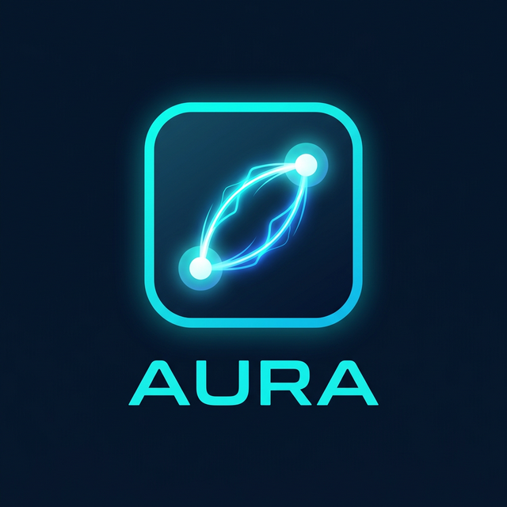

<div align="center">
  
  <h1>AURA</h1>
  <p><strong>P2P File Transfer Utility &middot; Engineering Futurist UI</strong></p>
  <p>100% Local. Zero Cloud. Pure Privacy.</p>
</div>

---

## Overview

**Aura** is a premium, offline-first peer-to-peer file transfer utility. It bypasses cloud servers completely, instead utilizing WebRTC Data Channels and local signaling to transfer files directly between devices on your local network. 

Designed with an **"Engineering Futurist"** philosophy, Aura combines the utilitarian precision of an IDE with the sleek aesthetics of a modern automotive dashboard. The result is a highly polished, glassmorphic interface that looks and feels like a specialized engineering tool.

## Features

### "Midnight Engineering" Interface
- **Glassmorphic Node Cards**: Frosted-glass UI elements representing network peers.
- **Circuit Board Animation**: A subtle, non-distracting CSS/Canvas background featuring glowing data-flow traces mapping out connections.
- **Radial Progress Rings**: Minimalist SVG rings tracking file transfer progress in real-time, accompanied by streaming data-packet effects.
- **Fluid Reponsiveness**: Flexbox and CSS Grid layouts adapting seamlessly from smaller mobile screens to large desktop monitors.

### Pure Privacy & Local Transfers
- **True P2P**: Files stream from RAM to RAM via WebRTC. Data never leaves your network.
- **Zero Cloud Architecture**: Operates without external STUN/TURN servers.
- **LOCAL MODE ACTIVE**: Top-bar hardware-style badge confirming offline operation and total local network confinement.
- **Offline PWA**: Fully functional offline web application, powered by a robust Service Worker.

### Hybrid Peer Discovery
- **Local Network Auto-Discovery**: Instantly identify other Aura instances running on the same network.
- **Bluetooth Proximity**: Seamlessly discover and fall back to nearby devices using the Web Bluetooth API.

## System Architecture

```text
.
├── index.html                   # Entry point: Status bar, Circuit canvas, App main
├── manifest.json                # PWA manifest
├── src/
│   ├── core/
│   │   ├── events.js            # Lightweight Pub/Sub event bus
│   │   ├── aura-connection[...] # WebSocket signaling
│   │   ├── p2p-transfer.js      # Core WebRTC engine
│   │   ├── file-chunker.js      # Efficient file slicing
│   │   ├── file-digester.js     # Blob reassembly
│   │   └── bluetooth-disc[...]  # Web Bluetooth API integration
│   ├── ui/
│   │   ├── components.js        # Node Cards, Dialogs, Canvas Animations
│   │   ├── clipboard.js         # Fallback clipboard polyfill
│   │   └── styles.css           # "Midnight Engineering" Design System
│   └── service-worker/
│       └── sw.js                # Offline caching layer
├── server/
│   ├── index.js                 # Network local signaling hub (Node.js)
│   └── package.json             
├── images/                      # Progressive Web App icons
└── sounds/                      # Feedback audio
```

## Quick Start

### 1. Launch the Local Hub (Signaling Server)

```bash
cd server
npm install
npm start
```
*The local hub operates on port **3000** by default.*

### 2. Launch the Application

Serve the root directory using any static file server:

```bash
# E.g., using Python
python -m http.server 8000

# E.g., using npx
npx serve .
```

### 3. Connect Devices

1. Ensure all devices are on the same local network (Wi-Fi/LAN).
2. Open the application URL (e.g., `http://<your-local-ip>:8000`) on multiple devices.
3. Devices will automatically discover each other and populate the workspace as detailed Node Cards.
4. Click or tap a Node Card to transfer files, or right-click / long-press to send secure text messages.

---
*Built by [Chandan Sai Pavan Padala](https://github.com/chandansaipavanpadala/PLINK-Peer_Local_Interface_Network_Knot)*
